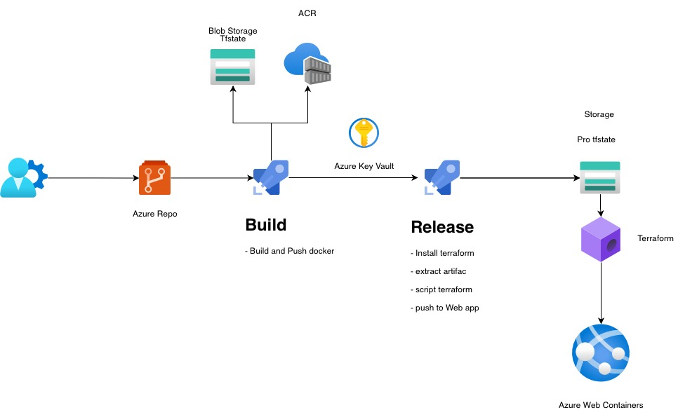
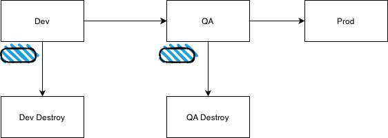

# AzureTerraformAdo

## Project Overview
- **Technologies Used**: ASP.NET8 Core MVC, Docker, Azure Web APP,Azure KeyVault,  Terraform, Azure Container Registry (ACR), Azure DevOps
- **Deployment Targets**: Development and Production staging environments on Azure
- **Continuous Integration and Deployment (CI/ CD)** uses a YAML pipeline.

## Architecture Diagram

## Stages

